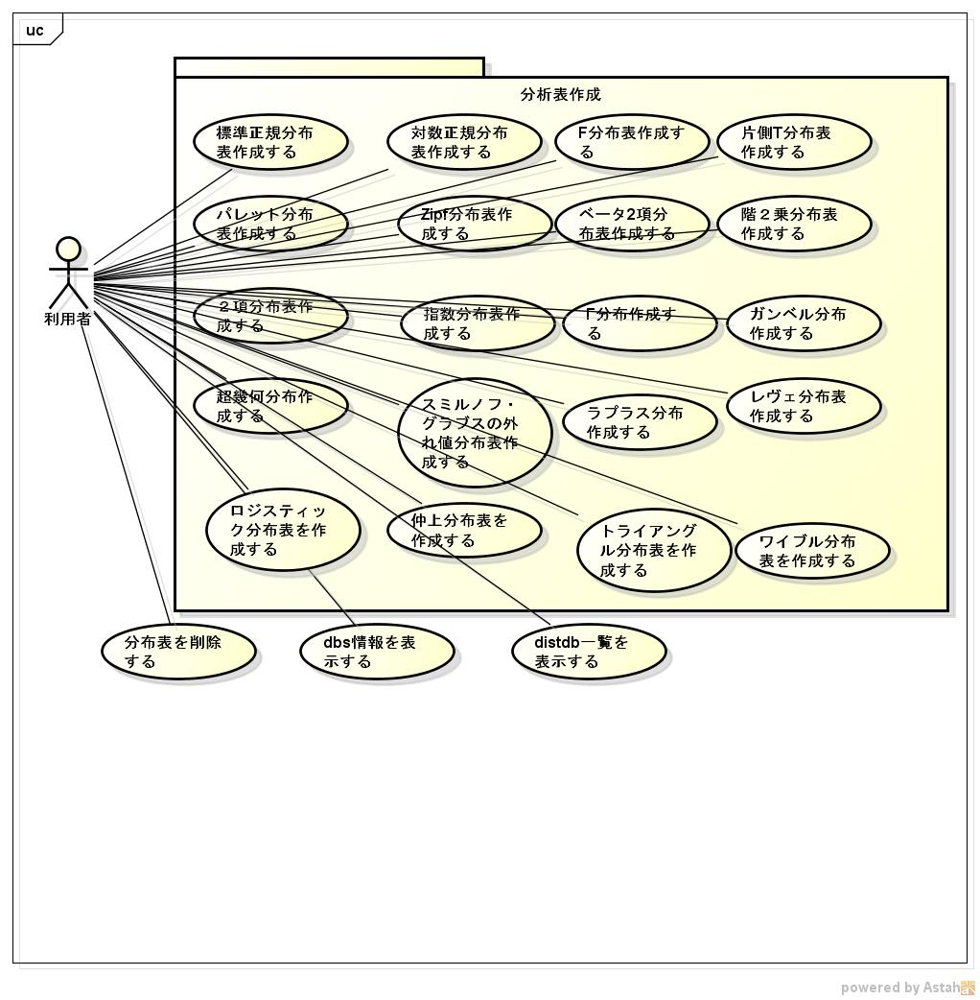

mongodbtool
========
commons-math3を利用して、分布表のデータをmongodbに格納ツールです。

## Description ##

## Demo ##

## VS. ##

## Requirement ##
java11対応  
mongo c driver 1.17

## Usage ##
詳細は、
https://github.com/siranovel/mongodbtool/wiki

## install ##
    git clone https://github.com/siranovel/mongodbtool.git  
    cd mongodbtool  
    rpm -ivh <rpmファイル名>  

## Contribution ##

## Licence ##

[GPLv2](LICENSE)

## Author ##

[siranovel](https://github.com/siranovel)
