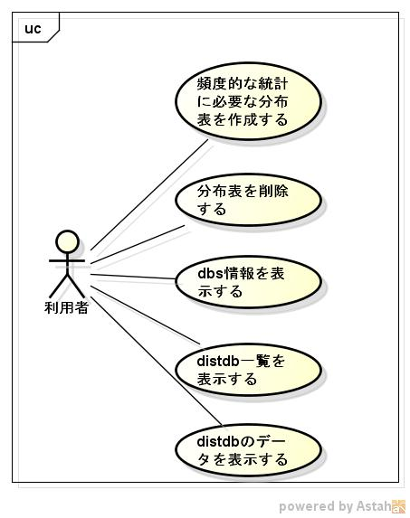

mongodbtool
===========
commons-math3を利用して、分布表のデータをmongodbに格納ツールです。

## Description ##

詳細は、https://siranovel.github.io/mydocs/mongodbtool  

## Demo ##

## VS. ##

## Requirement ##
java11対応  
mongo c driver 1.17  
Apache commons-math3

## Usage ##

## install ##
    git clone https://github.com/siranovel/mongodbtool.git  
    cd mongodbtool/bin  
    任意ディレクトリへコピーし、tarファイルを解凍  

## Contribution ##

## Licence ##

[GPLv2](LICENSE)

## Author ##

[siranovel](https://github.com/siranovel)
